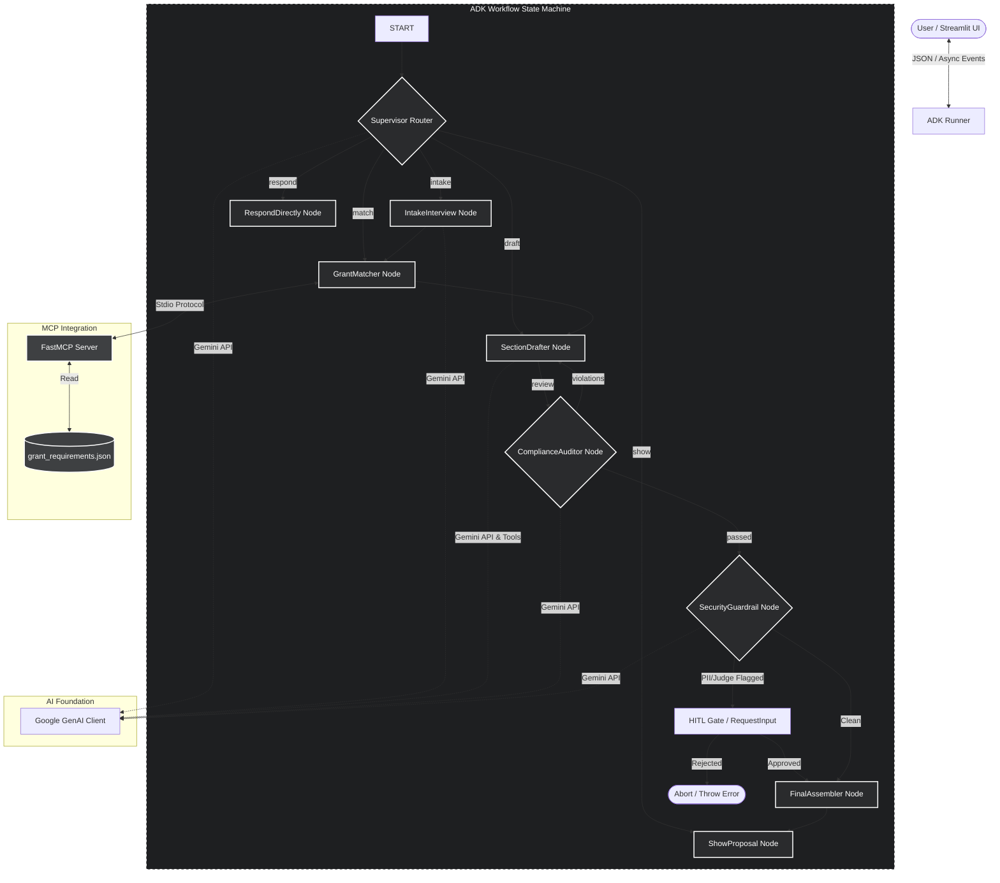

# 🌱 Eco Grant Writer Agent

Eco Grant Writer is a state-of-the-art conversational AI agent designed to guide non-profit organizations through the process of drafting professional, compliant, and secure environmental grant proposals. Built on top of the **Google Agent Development Kit (ADK) 2.0** and powered by the **Gemini LLM**, it provides a multi-layered guided workflow that handles intake interviews, local grant matchmaking, section-by-section drafting, compliance checks, and privacy-oriented security review.

---

## 🏛️ System Architecture

The project is structured around a central workflow orchestrator that manages state transitions between isolated task-oriented nodes. The application separates concerns between the user interface, the agent workflow, and local tools exposed via the **Model Context Protocol (MCP)**.

### Architecture Overview



---

## 🛠️ System Design

### 1. State Orchestration (`GrantWriterState`)
The agent's memory and parameters are managed by the unified Pydantic state model `GrantWriterState` (defined in `grant_writer/models.py`). This state tracks:
* **Workflow Phase:** Current phase (`intake` | `matching` | `drafting` | `review` | `complete`).
* **Intake Metadata:** Organization details, location, currency details (symbol/code), volunteers, and registration details.
* **Matched Grant Guidelines:** Selected grant schema details, mandatory proposal sections, and word count rules.
* **Drafts Buffer:** Mapping of section names to generated drafts (`sections_drafted`).
* **Compliance & Security Reports:** Flagged violations, audit comments, and security judge approvals.
* **Chat Memory:** Conversation log of `ChatMessage` objects for context-aware dialog.

### 2. Workflow Nodes
All workflow nodes reside in `grant_writer/nodes/` and are built as async functions decorated with `@node`:

* **`Router`:** Supervises incoming user messages, checks input constraints, appends comments to chat history, and uses Gemini to classify the user's intent, dynamically routing control to the correct node.
* **`IntakeInterview`:** Walks the user through missing criteria (e.g. project location, summary) using LLM-based parsing and deterministic fallback regex patterns to extract fields from messy raw notes.
* **`GrantMatcher`:** Scores and matches the project profile against the available grants. Communicates over a stdio channel with a local FastMCP subprocess to fetch the grant database.
* **`SectionDrafter`:** Sequentially drafts proposal sections in a **ReAct (Reasoning and Acting) loop** with self-correction capabilities. Integrates local tools (e.g. budget calculators, NGO Darpan validators) to construct tables or verify inputs, running compliance feedback loops up to `MAX_REACT_ITERATIONS` times before presenting the draft section.
* **`ComplianceAuditor`:** Reviews the draft proposal using a **dual-layer audit strategy**:
  1. *Deterministic layer:* Validates the presence of mandatory sections, limits, metrics, and checks for prohibited terms (e.g. full-time staff salaries).
  2. *Semantic layer:* Reviews formatting, stylistic structure, and nuanced criteria with an LLM.
* **`SecurityGuardrail`:** Evaluates the draft against STRIDE threats (specifically Information Disclosure). Employs a regex PII scrubber and an **LLM-as-a-Judge** scoring module. If issues are found, prompts a **Human-in-the-Loop (HITL)** bypass/abort gate via ADK `RequestInput`.
* **`FinalAssembler`:** Merges the individual section texts into a single, cohesive, standardized Markdown document (`drafted_proposal`).

### 3. Integrated Tools
* **FastMCP Server (`mcp_server.py`):** Serves local JSON requirements database (`grant_requirements.json`) exposing `list_available_grants` and `get_grant_guidelines` tools. Runs as an isolated stdio child process spawned automatically by the `GrantMatcher` node.
* **PII/Financial Scrubber (`grant_writer/security/pii_scrubber.py`):** Automatically scans and redacts patterns for Aadhaar, PAN, emails, phone numbers, bank accounts, and specific salary strings.
* **NGO Validator (`grant_writer/tools/ngo_validator.py`):** Evaluates NGO Darpan registration formatting rules (e.g. `StateCode/Year/Number`).
* **Budget Calculator (`grant_writer/tools/budget.py`):** Outputs a balanced, Markdown-formatted itemized budget table from a total budget figure.

---

## 🔄 System Dataflow

```
[User Notes Input]
       │
       ▼
┌──────────────┐
│  Ingestion   │ ──► Parse budget & currency (Regex/LLM)
└──────────────┘
       │
       ▼
┌──────────────┐
│  Intake Node │ ──► Ask follow-ups until project location & summary are resolved
└──────────────┘
       │
       ▼
┌──────────────┐
│ Grant Match  │ ──► Spawn local MCP Server ──► Score and recommend grants ──► Confirm Selection
└──────────────┘
       │
       ▼
┌──────────────┐
│ Drafter Node │ ◄─┐
└──────────────┘   │ Draft section ──► Local tool execution (Budget/NGO validation)
       │           │
       ▼           │
┌──────────────┐   │
│ Compliance   │ ──┴──► Reject and self-correct section if word limits/prohibitions violate
└──────────────┘
       │ (Passes)
       ▼
┌──────────────┐
│   Security   │ ──► Run PII Scrubber & LLM-as-a-Judge
└──────────────┘
       │
       ├─► (Flagged) ──► Trigger HITL RequestInput ──► User Approves/Aborts
       │
       ▼ (Passes / Approved)
┌──────────────┐
│  Assembler   │ ──► Format metadata headers ──► Clean & merge markdown sections
└──────────────┘
       │
       ▼
[Final Proposal Output]
```

---

## 📥 Git Installation & Local Setup

Follow these steps to set up, develop, and run the project locally.

### 📋 Prerequisites
* **Python:** Version `3.11` or higher is required.
* **Git:** Installed and configured.
* **API Key:** A valid Gemini API key.

### 1. Clone the Repository
Clone the repository using git:
```bash
git clone https://github.com/BhupendraLute/eco-grant-writer-agent.git
cd eco-grant-writer
```

### 2. Set Up a Virtual Environment
Create a clean virtual environment and activate it:

**On Windows (Command Prompt / PowerShell):**
```powershell
python -m venv .venv
.venv\Scripts\activate
```

**On macOS / Linux:**
```bash
python3 -m venv .venv
source .venv/bin/activate
```

### 3. Install Dependencies
Install the package along with its core dependencies in editable mode, including development dependencies for testing and linting:
```bash
pip install -e .[dev]
```

### 4. Configuration
Create a `.env` file in the root of the project:
```bash
cp .env.example .env   # Or create it manually
```
Edit the `.env` file to add your credentials:
```env
GOOGLE_API_KEY="your-gemini-api-key-here"
LLM_MODEL="gemini-2.5-flash"
GOOGLE_GENAI_USE_ENTERPRISE=0
```
> [!IMPORTANT]
> The `.env` file should never be committed to git. Local pre-commit hooks are configured to prevent this behavior.

### 5. Install Git Pre-commit Hooks
The project has pre-commit hooks configured for code styling and security checks (checking for exposed API keys and preventing `.env` commits). Install them by running:
```bash
pre-commit install
```

### 6. Run the Test Suite
Ensure your environment is set up correctly by running the unit and integration tests:
```bash
pytest
```

### 7. Run the Application
Start the conversational Streamlit user interface locally:
```bash
streamlit run app.py
```
This command will start the Streamlit web server and open a page in your web browser (typically at `http://localhost:8501`).
